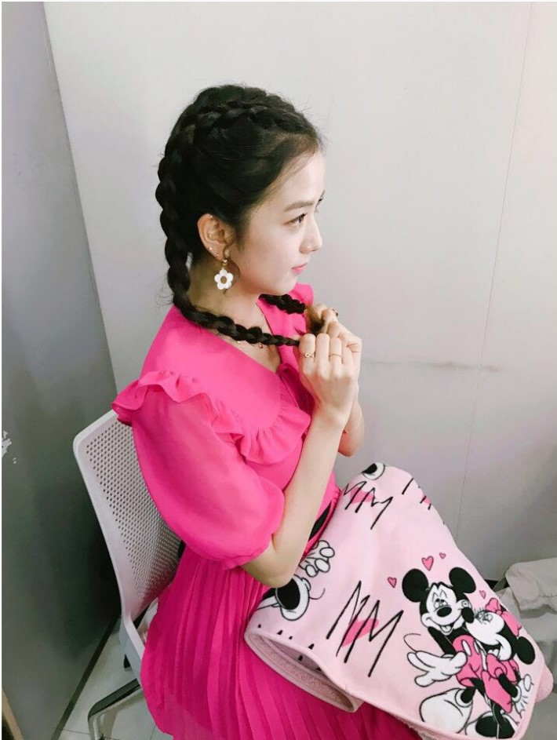
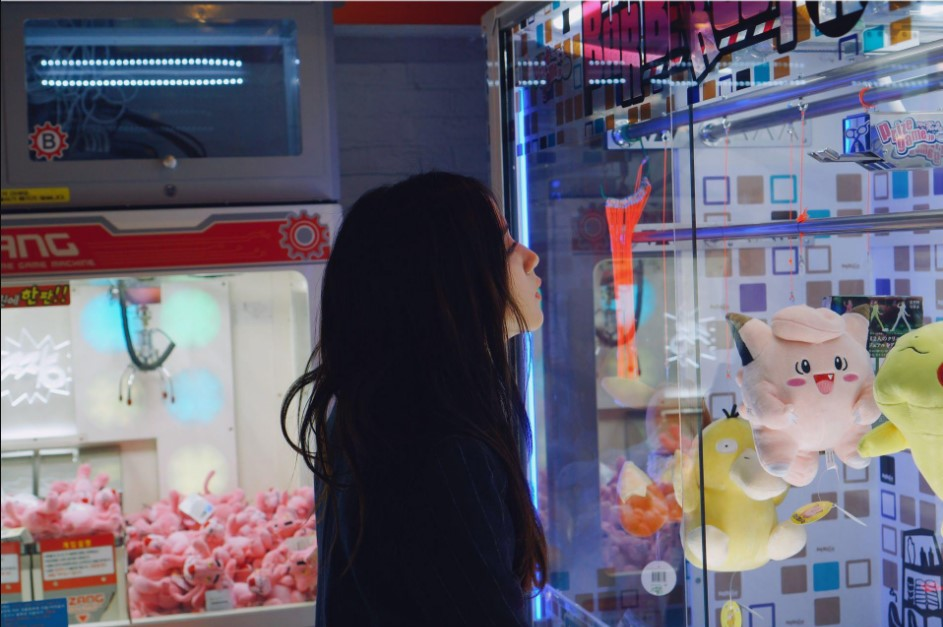

  

    <h2>标题栏</h2>
    <ul>
      <li><a href="#性感">性感</a></li>
      <li><a href="#可爱">可爱</a></li>
      <li><a href="#少女">少女</a></li>
      <li><a href="#御姐">御姐</a></li>
      <li><a href="#萌妹">萌妹</a></li>
    </ul>
  

  

   <h2 id="性感">性感</h2>
         
  [性感](./images/15.jpg)
  
   <h2 id="可爱">可爱</h2>
  
  

   <h2 id="少女">少女</h2>
  
  

   <h2 id="御姐">御姐</h2>
  
   
 
   <h2 id="萌妹">萌妹</h2>

  
  

